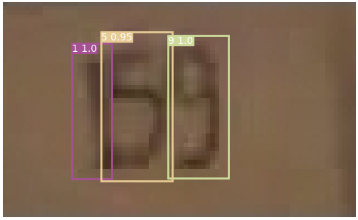
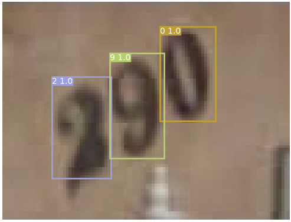
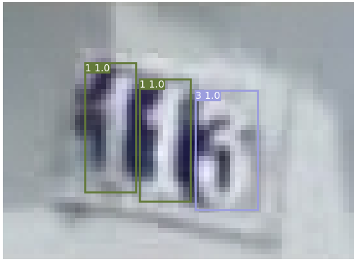

# Tianchi character recognition
### torch==1.6.0
### tensorflow-gpu==1.13.1
### 原始github：https://github.com/eriklindernoren/PyTorch-YOLOv3
[天池比赛链接](https://tianchi.aliyun.com/competition/entrance/531795/introduction?spm=5176.12281925.0.0.5c0f7137PjPicq)  

### 训练
1、下载赛题数据，然后解压到data文件夹，安装相应的python库，运行processes.py文件，生成相应的训练数据，以及数据概览 
   生成的训练数据在data/custom中，和Darknet官方的训练数据格式一致都是VOC格式 
 
2、下载Darknet[官方预训练模型](https://pjreddie.com/media/files/darknet53.conv.74) ,并放入到weights文件夹中 
 
3、运行train.py文件训练分类网络，模型会保存在checkpoints文件夹里面日志文件会保存在logs文件夹里面， 
这里给出训练好的一个模型，[下载的链接](https://share.weiyun.com/sOKyH5Cf) ,下载以后放到checkpoints文件夹

### 测试
运行detect.py文件得到可视化的结果和提交文件，结果保存在output文件夹中 

### 结果
 
<i></i>

<i></i>

<i></i>
